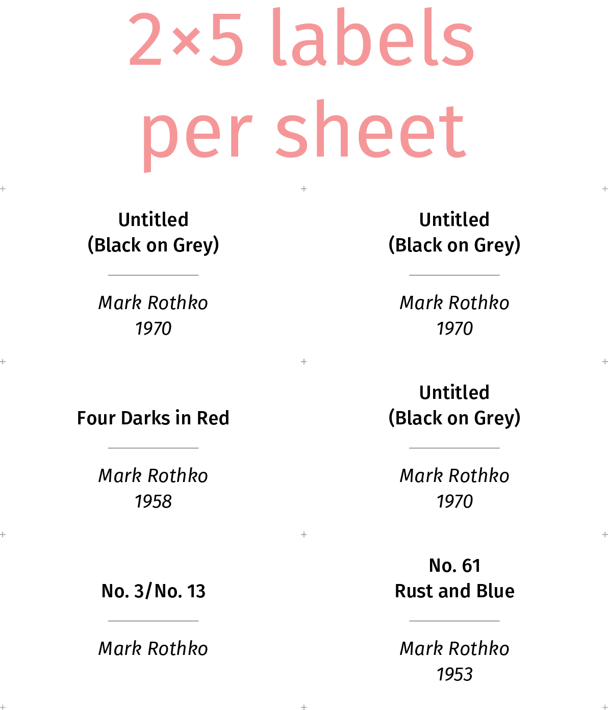

# PostScript Labels

This is a single PostScript file [labels.ps] to print labels by converting
it to PDF. The labels are for exhibitions or anything that can use labels
that consist of two parts, like using two languages. Each label consists of
one or two centered lines above and below a dividing line.

Adding a label requires just one line. The label above is generated by
the line

	[(No. 61) (Rust and Blue)] [(Mark Rothko) (1953)] card

that is part simply added at the end of [labels.ps]. (PostScript is a stack
language where parameters come first which are then consumed by procedure
`stack`. Here the two parameters are arrays, each containing two strings.)

Labels are arranged in a 2-by-5 matrix per sheet with optional cut marks.
The paper format is DIN A4 but can be easily changed to Letter (around line
29 of [labels.ps]).

The typical workflow to print such labels is:

1. Edit PostScript file [labels.ps] -- see below.
2. Convert PostScript file  to PDF (using ghostscript(1), pstopdf(1) or
   Acrobat Distiller)
3. Print PDF at 100% and cut out labels

# Using labels.ps

All you need is the file [labels.ps] from this distribution. All other
files are useful for developers but not required for creating labels.

The file [labels.ps] is in ISO-Latin-1 encoding because PostScript natively
cannot deal with UTF-8. This is important if you want to use non-ASCII
characters.

To define your own labels, edit [labels.ps]. Labels are defined at the end
of the file:

	%% Put labels here
	(No. 3/No. 13)(Mark Rothko) card

	%% You can have two lines at the top and bottom each.
	%% In that case lines need to be put into an array [...] 
	[(No. 61) (Rust and Blue)] [(Mark Rothko) (1953)] card
	[(Four Darks in Red)] [(Mark Rothko) (1958)] card

	%% You can repeat cards. Note how to escape () in strings.
	3 { 
		[(Untitled) (\(Black on Grey\))] [(Mark Rothko) (1970)] card 
	} repeat

	% this marks the end and ensures that the final page is emitted
	finalize

A label is created by each call to `card` which takes two arguments: the
strings that go at the top and the bottom of the card. If you want two
lines, these strings need to go into an array. Strings in PostScript are
delimited by parentheses. Inside a string you need to escape them with a
backslash.  Likewise, the percent sign `%` needs to be escaped as `\%`.

The first label goes into the lower left corner of the page and the next
one goes to the right of it. (The origin of PostScript coordinates is by
default the lower left corner of a page.)

# Fonts

Labels use the open-source font [FiraSans] that is part of the repository.
Individual font files are included already in [labels.ps]. The embedding of
fonts is controlled by the Makefile. Fonts are governed by their own
copyright.

# Development

The file [labels.ps] is generated by the Makefile from font files and the
source file [labels.src.ps](./labels.src.ps). Hence, to work on the
PostScript code, edit [labels.src.ps](./labels.src.ps) and not [labels.ps].

	$ edit labels.src.ps
	$ make

You need a tool to convert PostScript to PDF that is called from the
Makefile. I'm using `pstops` on OS X and would use `ps2pdf` on Linux.	

# License

[MIT License](./LICENSE.md)

[labels.ps]:	./labels.ps "PostScript file labels.ps"
[FiraSans]:		https://en.wikipedia.org/wiki/Fira_Sans "FiraSans font"
